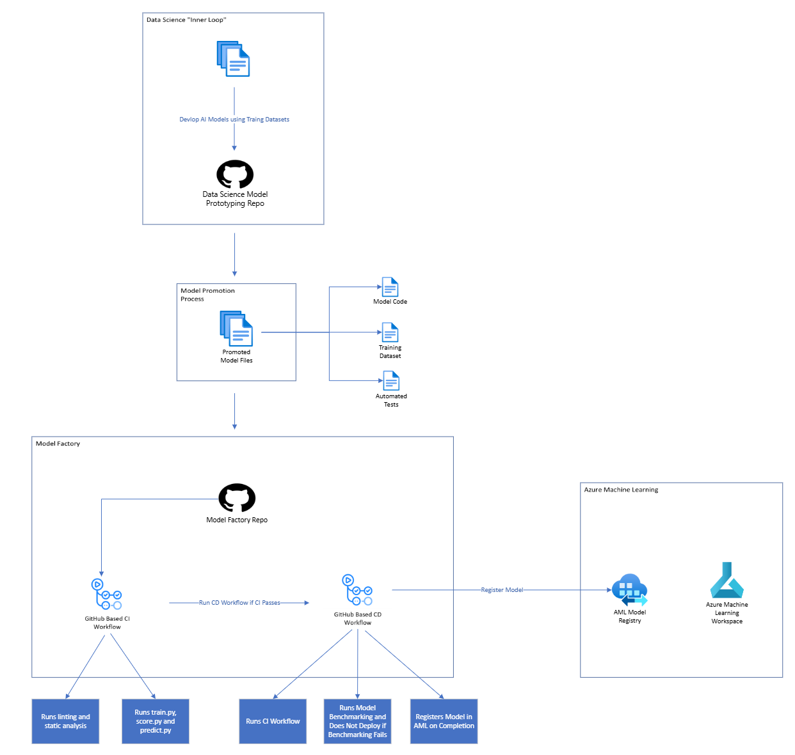
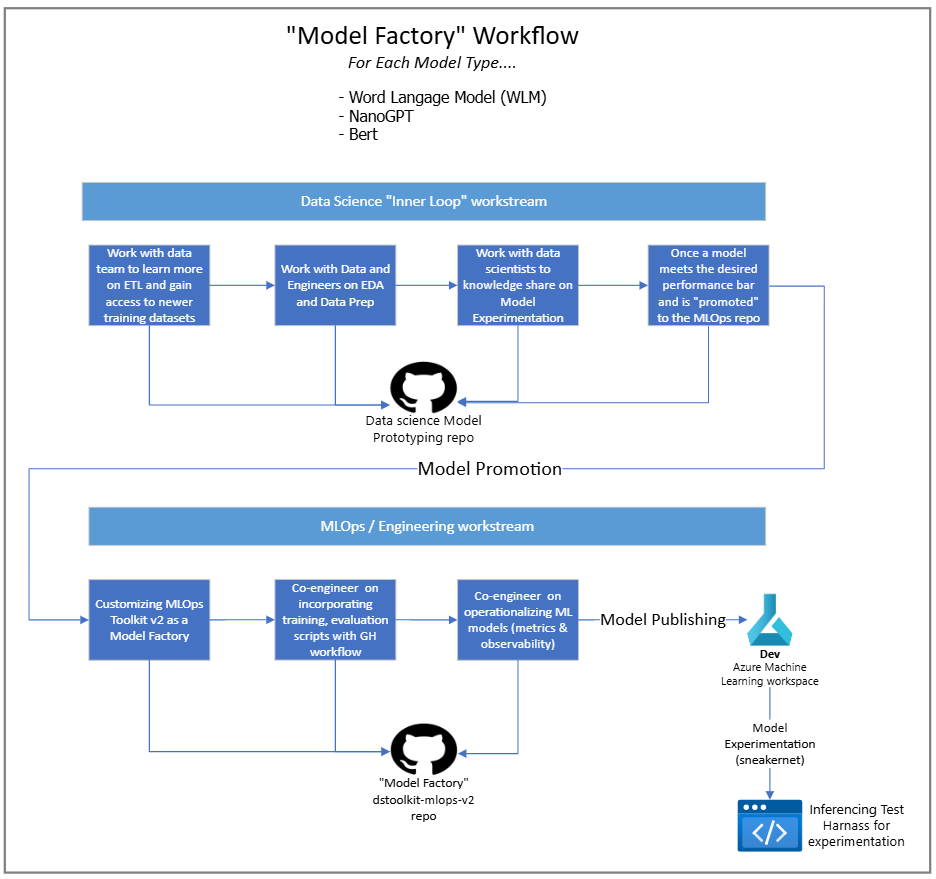
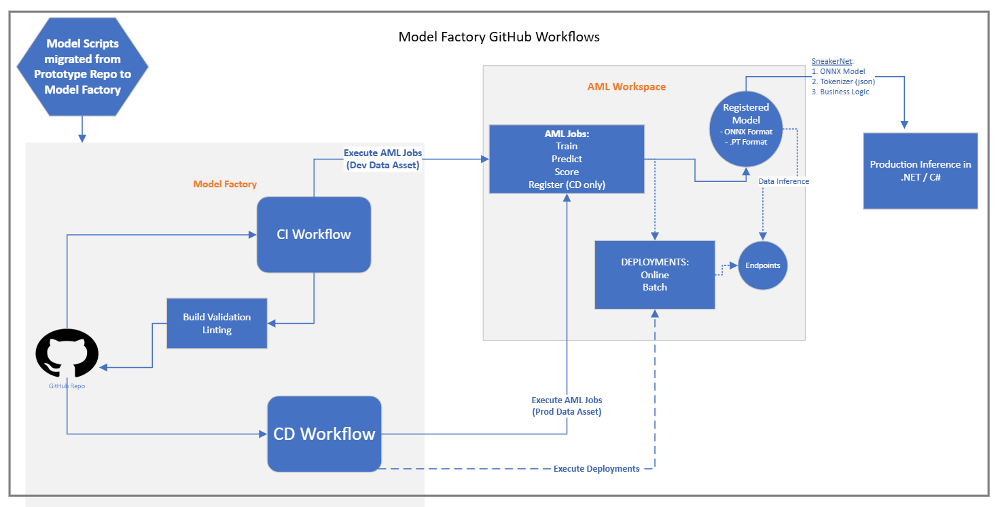
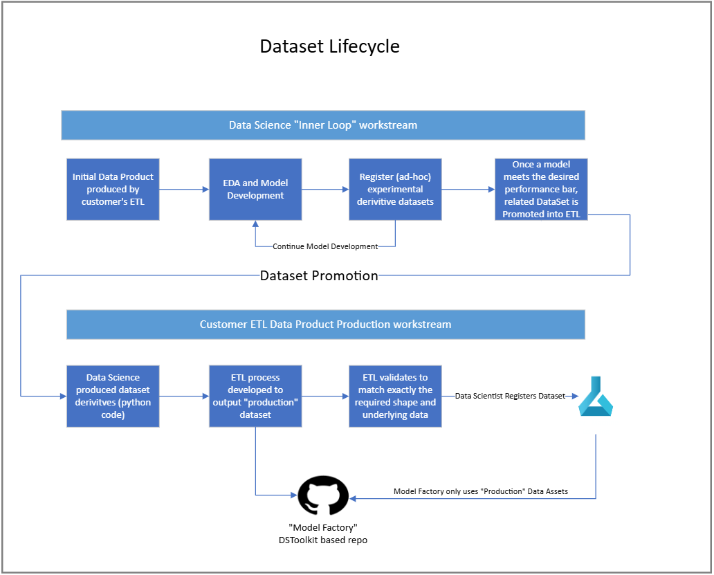

# Multi-Repository Model Development and Promotion Design

## Overview

This documentation outlines the design of an AI Model Factory consisting of two GitHub repositories: the Data Science / Prototyping Repository and the Model Factory / MLOps Repository. This design allows data scientists to focus on model development without the constraints of adhering to strict engineering practices, while ensuring that models are rigorously tested and deployed through automated processes.

## What is a Model Factory?

A Model factory based on DSToolkit v2 enables analytics and data science teams in partnership with software engineering teams to go from model development to a stable, reliable and auditable production model artifact built and maintained with strong software engineering fundamentals such as developer experience, testing, observability, release management, DevOps and automation.

A related Repository, the Data Science Repository, is where the data science team can focus on Exploratory Data Analysis and model development. The next couple of sections discusses the relationship between the data science repo and the Model Factory in more detail.

## Dedicated Repositories

1. Data Science / Prototyping Repository:

    - Purpose: A sandbox environment for data scientists to develop and experiment with AI models.
    - Key Features:
        - Freedom of Development: Data scientists can freely develop models without the need to adhere to strict engineering practices.
        - Basic CI: In order to allow data scientists the freedom to experiment without the burden of strict engineering fundamentals, only basic CI is implemented.  This CI enforces basic code quality and security principals via linting, static analysis and secrets checking.
        - Documentation: Basic documentation for model development, including data sources, preprocessing steps, and model architecture.
2. Model Factory / MLOps Repository:
    - Purpose: A repository where production quality engineering fundamentals are enforced including automated testing, and deployment of AI models.
    - Key Features:
        - Continuous Integration and Deployment (CI / CD): Automated training, testing and deployment of AI models.
        - Engineering Best Practices: Enforces coding standards via linting, static analysis and secrets checking, unit tests, data inferencing tests, and other engineering fundamentals.
        - Benchmarking: Benchmarks model accuracy / performance and compares it against previous model benchmarks.  If benchmarking fails, indicating model performance is reduced, the model is not deployed.
        - Observability: Leverages MLFlow to publish key metrics.
        - Documentation: Comprehensive documentation for using the model factory, integrating new models, model promotion process, dataset management, automated model inferencing, MLOps / CI / CD, observability and metrics, etc.

This approach allocates separate, dedicated repositories for both data scientist's experimentation ("prototyping repo") and the model factory.  Data scientists are free to make quick, iterative experimental changes in the prototyping repo, free from the string engineering fundamentals of the model factory.  Once a model meets the expected quality / criteria, the model, associated training datasets and automated / inference tests are copied and integrated into the model factory using a defined promotion process.

Pros:

- **Freedom for Experimentation**: Working in a dedicated / independent repo provides data scientists the freedom to experiment and iterate quickly without the constraints of the strict engineering fundamentals applied in the model factory.  Each change does not need to be production ready / deployable.
- **Only Production Candidate Models Registered**: Because data science experimentation is confined to the dedicated data science repository, only models that are candidates for production are integrated into the model framework.  This reduces clutter and provides a clean history by regulating experimental models to the data science repository.
- **Self-Documenting Experimentation**: Because data science experimentation is done in its own repository, a history of experimental / prototyping changes is preserved in the source control history.  This can be used for later reference or if new modeling techniques come available and we want to revisit an experiment with a base model.

Cons:

- **Models Require Integration**: Once models developed in the data science repo meet the requirements, they can be promoted, at which time they must be explicitly integrated into the model factory.  This merging process takes time and is a tax on productivity.  This process is outlined below.

The cons associated with having two repos can be minimized by:

- Establishing / enforcing consistency in how model building and other associated scripts are implemented and organized (i.e. not one big / long script).  A consistent pattern / structure of files should be established and followed when implementing new models.
- Establishing / enforcing a minimum code quality bar in the prototyping repo.  While the rigorous engineering fundamentals of the model factory are not necessary or desirable, code developed in the prototyping repo should be linted, have static analysis performed and checked for secrets / credentials.  It’s a good idea to implement a simple CI pipeline to handle this.
- Referencing inputs and outputs to the scripts in the prototyping repo adhering to the way they are defined in the model factory.  It would be easy to simply reference local files as inputs and outputs to scripts in the prototyping repo.  This, however, causes additional work when integrating them into the model factory as they need to be updated to read and write from files in AML.  Preemptively referencing files in this way in the prototyping repo saves time during integration into the model factory.

## Data Science Workflow

Data scientists and software engineers often have very different workflows.  Developing a machine learning model is a highly iterative workflow starting with Exploratory Data Analysis.  Exploratory Data Analysis (EDA) is a crucial step in every data science project.  It involves thoroughly examining and characterizing the data to uncover its underlying characteristics, possible anomalies, and hidden patterns and relationships.  By understanding the data through EDA, data scientists are better equipped for subsequent steps in the machine learning pipeline, such as data preprocessing, model building, and analyzing results in order to determine whether a model prototype qualifies as a candidate for further inference experimentation to gain additional feedback with an eye towards production deployment.

Data scientists can range from specialists in data analysis to proficient software engineers, or a blend of both skill sets.  The goal is to tailor the model development process to be as productive as possible when prototyping and experimenting as part of model development.  In the spirit of “fail fast”, implementing full engineering fundamentals on this experimentation process simply adds friction and may not be well-received by data scientists accustomed to performing model development on a stand-alone machine.  To meet these requirements a dedicated Prototyping repo with branch protection and a minimal CI workflow that includes linting and checks to prevent checking in secrets can provide the flexibility needed for model experimentation with light engineering fundamentals.

Once a machine learning model under development by the data science team meets the target quality bar as defined by the customer, the model code in the Prototyping repo can be "promoted" into the Model Factory.

## Model Promotion into the Model Factory

Model promotion into the Model Factory is a collaborative process between the data scientist and the AI software engineer to incorporate the data scientists machine learning source artifacts into a production quality framework for maintaining, testing, and producing models for production use.

Once models developed in the data science repo meet the requirements, they can be promoted.  During promotion, the model code, and automated tests are copied from the data science repo and integrated into the model framework.  Additionally, the dataset used to train the promoted model is integrated into existing ETL processes such that it is automatically registered in AML when ETL runs.

The following diagram provides a high level overview of this process:

For each model, a set of GitHub workflows are developed that help enforce software engineering fundamentals:

## Data Product and Dataset Management

Management of models and the Datasets used to train models requires a production-quality approach to ensure traceability of a given model version to the dataset version used to train that model for production deployment.  At the same time, data scientists and software engineers require a low friction means to transform datasets as needed into new datasets to enable model training experimentation to meet performance goals.

When the data science team is working with models, a key driver of model performance is the underlying dataset.  As part of Exploratory Data Analysis (EDA) and model training, experiments with the dataset shape and underlying data is expected.

When a model meets the desired scoring criteria and is promoted to the Model Factory, the underlying dataset used to train the model will likewise need to be promoted as a versioned production dataset.

The customer should leverage their current ETL infrastructure to produce the production, versioned, dataset that will be incorporated into the Model Factory. This diagram depicts the dataset lifecycle:

