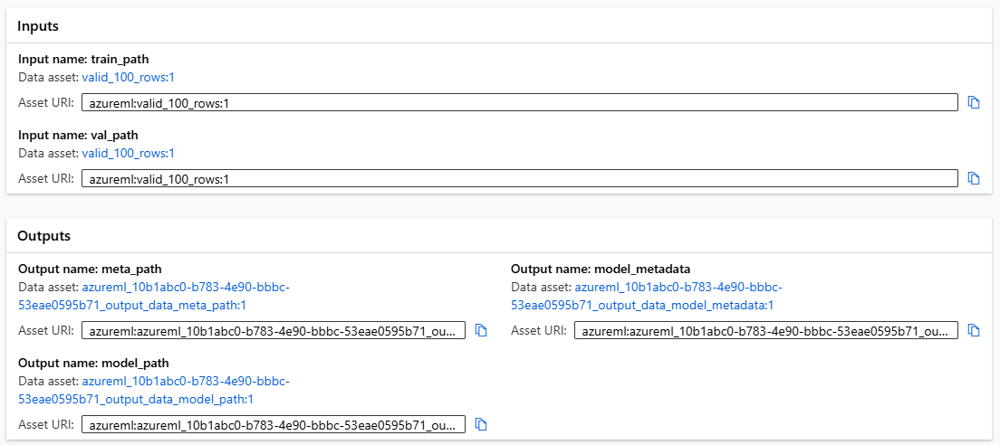

# Data Science Script Inputs and Outputs

## Context and Scope

The GitHub workflows create Azure Machine Learning (AML) jobs which in turn run the scripts defined under this repo's src directory.  For example, [src/nyc_src/train/train.py](/src/nyc_src/train/train.py).  Each of these scripts requires a series of inputs and produces outputs which can be used in downstream scripts.  Understanding how inputs and outputs to these scripts function is critical when integrating promoted models.

## Script Inputs and Outputs

Each script defines a series of inputs and outputs in its component yaml file.  For example, [mlops/nyc_taxi/components/train.yml](/mlops/nyc_taxi/components/train.yml).  Inputs can be either predefined files or outputs from previous / upstream scripts.  For example, the nyc train script defines the following:

```yaml
inputs:
  train_path: 
    type: uri_file
  val_path:
    type: uri_file
outputs:
  meta_path:
    type: uri_folder
  model_path:
    type: uri_folder
  model_metadata:
    type: uri_folder
```

These inputs and outputs are registered on the train step / run of the AML job



The storage location and dataset names for outputs are dynamically generated by AML when the job is registered / executed.  The paths / names to these output locations / datasets are not ones we specify, but are randomly generated by AML.  In this example, `meta_path` is stored in the generated name `azureml_10b1abc0-b783-4e90-bbbc-53eae0595b71_output_data_meta_path` and location `https://stmfds2.blob.core.windows.net/azureml-blobstore-c82a45e3-409d-4cd0-ad6c-345655337a74/azureml/10b1abc0-b783-4e90-bbbc-53eae0595b71/meta_path/`

Because the names and locations of output datasets are randomly generated, they are not known or specified ahead of time.  

Taking a look at the command used to run the train script, we see that the output locations are passed in with references to variables.  For example, `meta_path` is passed into the train script with the value of the variable `${{outputs.meta_path}}`.  The variable `${{outputs.meta_path}}` refers to the dynamically generated output name / location discussed above.  This means that the output path is actually specified as input to the script which is required because the output value is not known until the script is run and it's generated by AML.

The resulting command looks like:

```yaml
...
command: >-
  python -m src.nyc_src.train.train
  --train_path ${{inputs.train_path}}
  --val_path ${{inputs.val_path}}
  --meta_path ${{outputs.meta_path}}
  --model_path ${{outputs.model_path}}
  --model_metadata ${{outputs.model_metadata}}
  --device cuda
...
```
Passing the output variables as input to the scripts, allows these dynamically generated names / paths to be correctly referenced.

## References

- https://learn.microsoft.com/en-us/azure/machine-learning/how-to-manage-inputs-outputs-pipeline?view=azureml-api-2&tabs=cli
