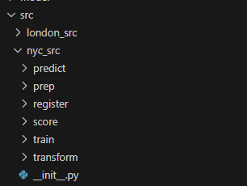
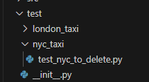

# Data Science Scripts - Foundational Structure: How to start drafting the DS scripts with respect to Model Factory Architecture

## Context and Scope

Data scientists perform exploratory data analysis (EDA) to understand the training data, and then perform experiments to create machine learning code that tunes a base model for the hypothesis based on the analysis of the training data. Data scientists can perform this work on their own workstation, on a Data Science Virtual Machine (DSVM), or on an Azure Machine Learning Compute instance.

Data Scientists need a flexible development environment with some engineering fundamentals such as main branch protection for PR review as well as a simple CI pipeline with python linting, secrets checking, markdown linting, etc. This environment let's the data science experiment with models running on Azure Machine Learning compute without impacting production code.

When a model is sufficiently developed by the data scientist, the model code is promoted to the Model Factory. How that code is structured can greatly ease integration of the data scientists code and is the focus of this design document.

## Goals

The Goals for this design document are:

- Define a structure for the Data Science scripts, which will ease the integration of Data Science scripts into Model Factory.
- Define all the areas of the Data Science scripts that need to be considered for integration into the Model Factory such as components, inputs, outputs, configuration, dependencies, logging, testing, and documentation.

## Non-Goals

This design does not provide details on how to train, evaluate, score, or register machine learning models.

## Overview

As discussed above, the structure of the Data Science code greatly impacts how easily the data science code can be  integrated into the Model Factory. This document provides a guideline on how to start building the Data Science scripts, keeping the Model Factory Architecture in mind.

## Detailed Design

This section provides a detailed, opinionated approach towards organizing the data science code for model training and evaluation with the goal of easing integration into the Model Factory.  The below are the areas to be considered for the Data Science scripts.

### Data Science Code Component Scripts

The Data Science code must be divided into individual scripts based on the functionality. For example, the NYC Data Science code can be divided into modular scripts:
    1. `train.py`
    2. `predict.py`
    3. `score.py`
    4. Others as needed.

These component scripts can be run independently or in a sequence. These scripts will be stored in the `src` folder of the DSToolkit for that particular model. For example, the NYC model scripts will be stored in the `src/nyc_taxi` folder as below:




### Data Science Code

The Data Science code is written in a modular way such that it can be easily integrated into the Model Factory. The code must be well-documented and should follow the best practices of coding. Having a minimal CI workflow in the data science repo as well as the same Dev Container in the Model Factory creates structure for these engineering best practices.

### Data Science Script Inputs and Outputs

The Data Science scripts must define a series of inputs and outputs. The inputs can be either predefined files or outputs from previous / upstream scripts. The outputs are the results generated by the script which can be used in downstream scripts. Refer to [DSScriptInputsAndOutputs](../how-to/DSScriptInputsAndOutputs.md) for more details on DataScienceInputs and Outputs with examples.

Below is the sample code from `mlops/nyc_taxi/src/mlops_pipeline.py` where the outputs from train component is used in the predict and the output of predict in score components:

    ```python
    train_model_cmp = gl_pipeline_components[0](
        dataset_folder=pipeline_job_input,
    )
    predict_model_cmp = gl_pipeline_components[1](
        model_folder=train_model_cmp.outputs.model_folder,
        dataset_folder=pipeline_job_input,
    )
    score_model_cmp = gl_pipeline_components[2](
        pred_folder=predict_model_cmp.outputs.pred_folder,
    )
    ```

### Data Science Script Configuration

The Data Science script must have configuration, which defines the configuration parameter required for the data science scripts. The configuration file should be in yaml format and should be easily configurable. For example, the configuration file for the nyc_taxi model will be stored in the `src/nyc_taxi/common/nyc_config.yaml` folder. And the DS scripts can read the configuration file and use the parameters defined in it.  Below is an example of how the `nyc_taxi_config.yaml` file looks like:

    ```yaml
    dry_run: True
    train:
       constant_history_window: 32
       gradient_accumulation_steps: 40
       batch_size: 12
    ........
    ```

    And the `train.py` script will read the configuration file as follows:

    ```python
    # Load NYC yaml configuration
    import yaml
    nyc_config = yaml.safe_load(open(args.nyc_taxi_config))
    dry_run = nyc_config['dry_run']
    train_cfg = nyc_config["train"]
    gradient_accumulation_steps = train_cfg["gradient_accumulation_steps"]
    ```

### Data Science Python Code Dependencies

The Data Science script must define the python dependencies required to run the script. The dependencies can be defined in a requirements.txt file or in a conda environment file.

    Below is example of how the `mlops/nyc_taxi/environment/conda.yml` will look like:

    ```yaml
    name: prs-env
    channels:
    - conda-forge
    dependencies:
    - python=3.9
    - pip
    - pip:
        - python-dotenv
        - pandas
        - numpy==1.23.5
        - scikit-learn==1.3.2
        - mlflow>=2.9.2
        - azureml-mlflow>=1.5
    ```

### Data Science Script Observability

The Data Science script must have logging enabled to track the metrics for observability purposes. The logging must be done in a structured way such that it can be easily monitored.

Machine Learning model scripts, for example train.py, predict.py, etc. will publish parameters using MLFlow to ease debugging and troubleshooting. Below is an example of how the parameters can be logged using MLFlow:

    ```python
    import argparse
    import mlflow

    args = parser.parse_args()
    mlflow.log_params(vars(args))
    ```

### Data Science Script Testing

The Data Science script must be tested thoroughly to ensure that it works as expected. The testing must cover all the components of the script and should be automated as part of the CI pipeline to catch errors prior to merging code into `main`.

The Data Science scripts must be run individually as a python script and tested manually. However, in future, the testing can be automated using the [PYTest](https://docs.pytest.org/en/stable/getting-started.html#get-started) framework. The test files should be placed in the `test` folder of the DSToolkit.



Below is an example of how the test can be written for the train.py script using PYTest:

    ```python
    import pytest
    import train
    class TestNYCTaxi:
        def test_train(self):
            self.assertEqual(train(), "Training completed successfully")
    ```

### Model Training and Evaluation Documentation

The Data Science script must be well-documented to explain the functionality of the script. The documentation must include the inputs and outputs of the script, the configuration parameters, the dependencies, the logging, and the testing.

The document for the Data Science scripts for each model which explains the detailed design of models must be stored in the `docs` folder of the DSToolkit. The document must be in markdown format and should be easily readable. The document must be updated whenever there is a change in the Data Science scripts.

## Links

- [MLFlow](https://mlflow.org/docs/latest/index.html)
- [MLFlow Auto Logging](https://mlflow.org/docs/latest/python_api/mlflow.autolog.html)
- [PYTest Examples](https://docs.pytest.org/en/7.1.x/example/simple.html)