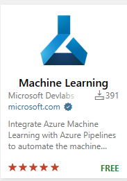

# Getting started with Model Factory

This solution supports Azure Machine Learning (ML) as a platform for ML, and Azure DevOps or github as a platform for operationalization. MLOps with Model Factory provides automation of the following:

* Infrastructure provisioning using either Azure Pipelines or github workflows using either Bicep or Terraform as the IaC language.
* A PR build triggered upon changes to one or more models.
* A CI build and deployment of one or more models to batch and online endpoints.

## Assumptions

* The user of this guide understands basic operations on Azure DevOps, github.com, visual studio code, or an IDE of their choice. Use the following guide to familiarize yourself with github [Getting started with your GitHub account](https://docs.github.com/en/get-started/onboarding/getting-started-with-your-github-account). Use the following guide to familiarize yourself with visual studio code [Visual Studio Code documentation](https://code.visualstudio.com/docs)

* Your team has an Azure Subscription within which to host Model Factory. If you don't have an Azure subscription, create a free account  by following this link. [Free Azure Subscription](https://azure.microsoft.com/en-us/free/search/?ef_id=_k_67e7bdd2a501151df8d8d83b02edc75b_k_&OCID=AIDcmm5edswduu_SEM__k_67e7bdd2a501151df8d8d83b02edc75b_k_&msclkid=67e7bdd2a501151df8d8d83b02edc75b)

* You have created an app registration to be used to operate the infrastructure, and AML build and ci pipelines.  

* You have granted the service principal above, at least Contributor, and User Access Administrator on the target subscription in Azure.
**Use this document as a reference when creating an app registration: [Create a Microsoft Entra application and service principal that can access resources](https://learn.microsoft.com/en-us/entra/identity-platform/howto-create-service-principal-portal)

## Setup your source control environment

**Step 1.** Clone the repository, create a *development* branch, and make it the default branch so that all PRs merge to it. This guide assumes that the team works with a *development* branch as the primary source for coding and improving model quality. Later, you can implement an Azure Pipeline to move code from the *development* branch to qa/main or that executes a release process with each check-in. However, release management is not in scope of this guide.

## Azure DevOps Setup

**Step 1.** Delete the .github directory.

**Step 2.** Create an Azure DevOps organization and project. Follow the instructions here: [Create a project in Azure DevOps](https://learn.microsoft.com/en-us/azure/devops/organizations/projects/create-project?view=azure-devops&tabs=browser)

**Step 3.** In Azure Pipelines > Library, create a new variable group named **"mlops_platform_dev_vg"**, add the variables and their values listed below: (Information about variable groups in Azure DevOps can be found in [Add & use variable groups](https://learn.microsoft.com/en-us/azure/devops/pipelines/library/variable-groups?view=azure-devops&tabs=classic).

**Note To provision test or production infrastructure create a new variable group, add the required variables, and modify the reference to the variable group in either infra_provision_bicep_pipeline.yml or infra_provision_terraform_pipeline.yml files.**)

> ⚠️ Some azure resource names have to be unique within your Azure subscription or region. Please make sure to use unique names.  One strategy is to append a three-part version to the names defined in the variables below (ie. For AML workspace, you might use "aml-mlw-001").

**Mandatory Infrastructure variables for bicep and terraform provisioning.**

* "APPINSIGHTS_NAME": Set to a value of your choosing.  Note the value must be unique.
* "AZURE_RM_SVC_CONNECTION":  Set to the name of the service connection created above.
* "CONTAINER_REGISTRY_NAME": Set to a value of your choosing.  Note the value must be unique.
* "KEYVAULT_NAME": Set to a value of your choosing.  Note the value must be unique.
* "LOCATION": Set to valid value for the "Name" property for Azure Region hosting the resource group and resources needed to operate the solution.
* "RESOURCE_GROUP_NAME": Set to a value of your choosing.  Note the value must be unique.
* "STORAGE_ACCT_NAME": Set to an unique alphanumeric value of your choosing.
* "SUBSCRIPTION_ID": Set to the subscription id for the subscription hosting the Azure Machine Learning workspace.
* "WORKSPACE_NAME": Set to a value of your choosing.  Note the value must be unique.

**Terraform only variables.**

* "TFSTATE_RESOURCE_GROUP_NAME": Set to an unique value of your choosing.
* "TFSTATE_STORAGE_ACCT_NAME": Set to an unique alphanumeric value of your choosing.

**Model Deployment Variables.**

**Note Models may be deployed to either batch, online, or both endpoints by setting the properties below. When both are configured to True, the ci pipeline will execute to both endpoints simultaneously.**

* "IS_BATCH_DEPLOYMENT" - Set to True to deploy models to a batch endpoint.
* "IS_ONLINE_DEPLOYMENT" - Set to True to deploy models to an online Endpoint.

**Step 4.** Create Azure Pipelines to deploy the infrastructure, and operate model builds and continuous integration.
Details about how to create a basic Azure Pipeline can be found in [Create your first pipeline](https://learn.microsoft.com/en-us/azure/devops/pipelines/create-first-pipeline?view=azure-devops&tabs).

**Step 5.** Create an azure pipeline to deploy the infrastructure using either the bicep (*.azure-pipelines/infra/bicep/infra_provision_bicep_pipeline.yml*) or terraform (*.azure-pipelines/infra/terraform/infra_provision_terraform_pipeline.yml*) yaml files.

**Step 6.** Create one or more Azure Pipelines to setup build validation for either or both of the use cases listed below:

* nyc_taxi
* london_taxi

**Step 7.** Create one or more Azure Pipelines to setup continuous integration for either or both of the use cases listed below:

* nyc_taxi
* london_taxi

**Step 8.** At the Organization Level within Azure Devops, add the Azure DevLabs Machine Learning extension by searching for Machine Learning, clicking the extension pictured below, and then Install on the ensuing page. If you do not have the required permissions, please ask the administrator of the organization to install the extension on your behalf.  



## GitHub Workflows Setup

**Step 1.** Delete the .azure-pipelines directory

**Step 2.** Add the following variables in Settings > Secrets and Variables > Variables:

* APPINSIGHTS_NAME: A string compliant with the naming convention for an azure application insights resource.
* ARM_CLIENT_ID: The application id corresponding to the service principal backing the service connection created above.
* ARM_TENANT_ID: The tenant id corresponding to the service principal backing the service connection created above.
* AZURE_RM_SVC_CONNECTION: The service connection name.
* CONTAINER_REGISTRY_NAME: A string compliant with the naming convention for an azure container registry resource.
* IS_BATCH_DEPLOYMENT: A Boolean indicating whether to create a batch deployment when executing a given model's ci pipeline.
* IS_ONLINE_DEPLOYMENT: A Boolean indicating whether to create on online deployment when executing a given model's ci pipeline.
* KEYVAULT_NAME: A string compliant with the naming convention for an azure key vault resource.
* LOCATION: A string compliant with the naming convention for an azure region short name.
* RESOURCE_GROUP_NAME: A string compliant with the naming convention for an azure resource group resource.
* STORAGE_ACCT_NAME: A string compliant with the naming convention for an azure storage account resource.
* SUBSCRIPTION_ID: A GUID for the azure subscription hosting the azure machine learning workspace.
* TFSTATE_RESOURCE_GROUP_NAME: A string compliant with the naming convention for an azure resource group resource. The tfstate resource group hosts a storage account for storing the tfstate file produced when using terraform infrastructure provisioning.
* TFSTATE_STORAGE_ACCT_NAME: A string compliant with the naming convention for an azure storage account resource. The tfstate storage account for storing the tfstate file produced when using terraform infrastructure provisioning.
* WORKSPACE_NAME: A string compliant with the naming convention for an azure machine learning workspace resource.

**Step 3.** Add the following secrets in Settings > Secrets and Variables > Secrets:

* ARM_CLIENT_SECRET: The is the client secret for the service principal backing the service connection created above.
* AZURE_CREDENTIALS: This secret is in the form below:

```json
{
"clientId": "<GUID>",
"clientSecret": "<PrincipalSecret>",
"subscriptionId": "<GUID>",
"tenantId": "<GUID>"
}
```

* RESOURCE_GROUP_NAME: A string compliant with the naming convention for an azure resource group resource.
* SUBSCRIPTION_ID: A GUID for the azure subscription hosting the azure machine learning workspace.
* WORKSPACE_NAME: A string compliant with the naming convention for an azure machine learning workspace resource.

**Note** Make sure this GitHub repository has proper [workflow and access permissions](https://docs.github.com/en/repositories/managing-your-repositorys-settings-and-features/enabling-features-for-your-repository/managing-github-actions-settings-for-a-repository#about-github-actions-permissions-for-your-repository).

Once you have completed this setup, it is a good idea to test out your setup by running an end-to-end test that includes all the steps detailed in [Testing the Intial Setup](./TestInitialSetup.md)
