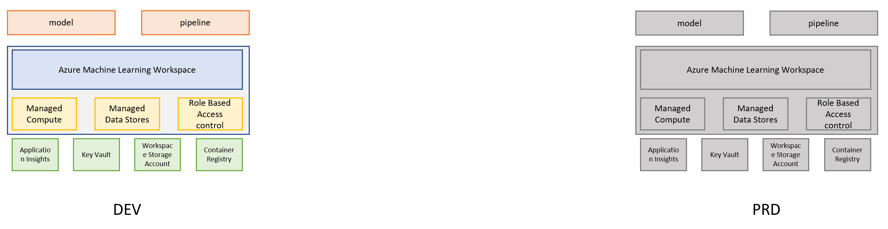
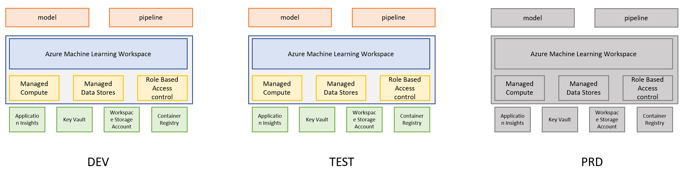

# Recommended Architecture

For teams who are starting with MLOps, we suggest to have at least two Azure Machine Learning instances. 
For teams with more familiarity with MLOps and Azure, we recommend to have three environments. 

## Storage Network Access Configuration

### Storage Security Baseline

The Model Factory provisions Azure Storage with a security-first baseline:
- **Public network access**: Disabled
- **Default network action**: Deny
- **Shared key access**: Disabled (policy-enforced)
- **Access control**: Azure AD authentication with RBAC

This configuration ensures storage is not exposed to the public internet and all access requires proper identity and role-based permissions.

### Temporary Public Access for Development

During development, training jobs and deployment endpoints need to download models and data from storage. In non-production environments (PR validation and dev testing), the workflows can temporarily enable public storage access for the duration of the job, then restore security restrictions afterward.

This pattern is controlled by the `enable_storage_public_access` workflow parameter:

**CI Workflows** (`*_ci_pipeline.yml`):
- Always use `enable_storage_public_access: true` (hardcoded)
- Acceptable for PR/dev environments where temporary public access trades security for simplicity and cost optimization
- Public access is enabled before training, then restored to restricted mode after job completion

**CD Workflows** (`*_cd_pipeline.yml`):
- `workflow_call` (orchestrated): defaults to `true` in model workflows, can be overridden by orchestrator
- `push` to main: uses `true` via conditional logic for automated dev deployments

**Stage/Production Deployments**:
- Set `enable_storage_public_access: false` when calling CD workflows for production environments
- Requires [private endpoints](https://learn.microsoft.com/en-us/azure/storage/common/storage-private-endpoints) or [service endpoints](https://learn.microsoft.com/en-us/azure/virtual-network/virtual-network-service-endpoints-overview) configured for storage
- Requires [resource access rules](https://learn.microsoft.com/en-us/azure/storage/common/storage-network-security?tabs=azure-portal#grant-access-from-azure-resource-instances) to allow Azure ML workspace and compute to access storage
- Endpoint managed identities must have `Storage Blob Data Reader` role assigned

### Workflow Examples

**Manual dev deployment with temporary public access:**
```bash
gh workflow run london_taxi_cd_pipeline.yml \
  -f exec_environment=dev \
  -f enable_storage_public_access=true
```

**Orchestrated production deployment with private networking:**
```bash
gh workflow run test_all_cd.yml \
  -f exec_environment=prod \
  -f enable_storage_public_access=false
```

### Network Configuration Timeline

**Current (v2.x)**:
- Infrastructure provisioned with public network configuration
- Temporary public access pattern available via `enable_storage_public_access` parameter
- Production deployments should set parameter to `false` and configure private/service endpoints manually

**Future**:
- Full private networking configuration will be provisioned via IaC
- Service endpoints or private endpoints created automatically
- Resource access rules configured during infrastructure provisioning
- `enable_storage_public_access: false` will work out-of-box for all environments

If you want to learn more about best practices, you can visit [Azure CloudFramework Best Practices](https://docs.microsoft.com/en-us/azure/cloud-adoption-framework/ready/azure-best-practices/ai-machine-learning-resource-organization)
