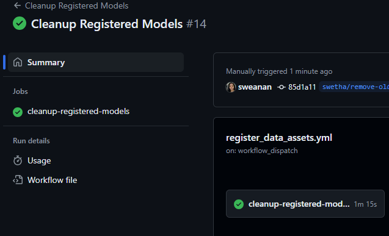
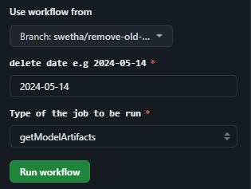
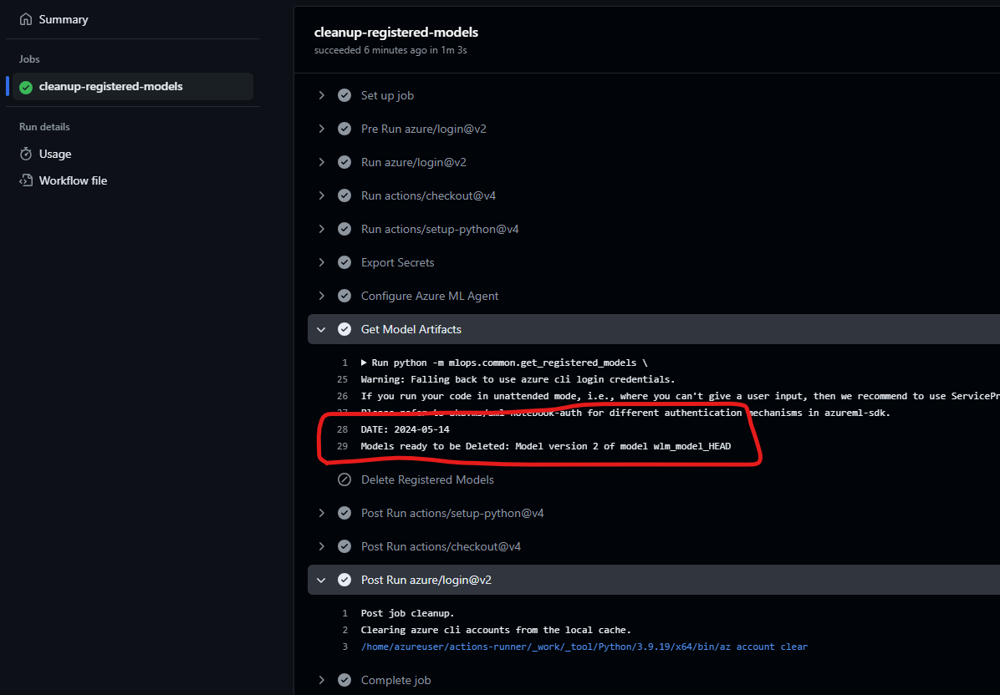
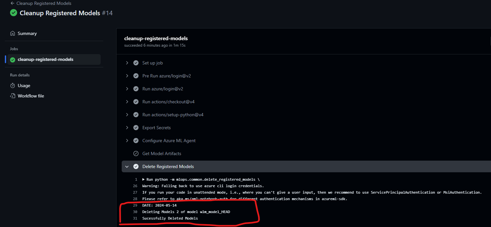

# Model Factory Asset Management

## Context and Scope

The Model Factory repository is home to machine learning models that meet metric targets and that have been promoted. The Model Factory implements engineering fundamentals to drive production quality model development. The inputs to the Model Factory are the registered datasets that are used in the CI and CD GitHub workflows to validate performance metrics published to MLFlow / Azure Machine Learning Studio through the AML Jobs(experiments). The output of the Model Factory are the registered model artifacts contained in the Azure Machine Learning Model Registry.

## Goals

This document outlines the process of cleanup of assets in the Azure ML workspace. These assets include Data Assets, Experiments(Jobs), and Registered Models in the Azure Machine Learning Studio that are created as part of the AML jobs.

## Detailed Design

This design provides guidance on cleanup/deleting the below assets from the Azure ML workspace.

### Deleting Data Assets

The data assets in the Model Factory repository are the registered datasets that are used in the CI and CD GitHub workflows to validate performance metrics published to MLFlow / Azure Machine Learning Studio through the AML Jobs(experiments). The data assets are stored in the Azure Machine Learning Studio.

Currently there is no direct way to delete the data assets using the Azure Python SDK as it does not support any delete API's for data asset.More information can be found in the [Azure Machine Learning SDK documentation](https://learn.microsoft.com/en-us/azure/machine-learning/how-to-create-data-assets?view=azureml-api-2&tabs=python#manage-data-assets).

However, Data assets can be manually [archived from the Azure Machine Learning Studio](https://learn.microsoft.com/en-us/azure/machine-learning/how-to-create-data-assets?view=azureml-api-2&tabs=python#manage-data-assets) as below. 

1. Navigate to the Azure Machine Learning Studio.
2. Go to the Datasets tab.
3. Select the dataset that needs to be Archived.
4. Click on the Archive button.

### Deleting Experiments(Jobs)

The experiments(Jobs) are the AML jobs that are created to validate performance metrics published to MLFlow / Azure Machine Learning Studio. The experiments(Jobs) are created as part of the CI and CD GitHub workflows.

Similarly, The Azure Python SDK does not support deleting job, however it does support deleting the experiment with `NO` Jobs. More information regarding the azure SDK API's for an experiment can be found in the [Azure Machine Learning SDK documentation](https://learn.microsoft.com/en-us/python/api/azureml-core/azureml.core.experiment.experiment?view=azure-ml-py#methods). So in order to delete an experiment with the python SDK API all the jobs associated with the experiment should be deleted manually first.

 To delete an experiment(Job) from the Azure Machine Learning Studio :

1. Navigate to the Azure Machine Learning Studio.
2. Go to the Jobs tab.
3. Select the experiment(Job) that needs to be deleted.
4. Click on the Delete button.

### Deleting Registered Models Artifacts

The registered models in the Azure ML workspace are the model artifacts that are created as part of the CI and CD GitHub workflows.

The registered Model can be deleted in 2 ways either from the Azure Machine Learning Studio Manually or using the Azure Python SDK.

#### Manually Delete Model Registration

To delete a registered model from the Azure Machine Learning Studio:

1. Navigate to the Azure Machine Learning Studio.
2. Go to the Models tab.
3. Select the registered model that needs to be deleted.
4. Click on the Delete button.

#### Automated Deletion of Model Registrations

To delete a registered model from the Model Factory repository using Python SDK API based on date, the below `cleanup registered models` GitHub Workflow can be used:

This workflow provides an option for running 2 types of Jobs:
1. `getModelArtifacts` - This enables the user to list all the registered models in the Azure ML workspace for a user specified date.
2. `deleteModelArtifacts` - This enables the user to delete the registered model artifacts from the Azure ML workspace for the same user specified date.

User need to provide the below inputs to run the job:
1. Date for which the registered models need to be deleted. The date should be in the format `YYYY-MM-DD`.
2. Job type.

#### GetModelArtifacts Job:

The `getModelArtifacts` job will list all the registered models in the Azure ML workspace for a user specified date, This way the user can validate all the registered models about to be deleted before actually deleting them.

#### DeleteModelArtifacts Job:

The `deleteModelArtifacts` job will delete the registered model artifacts from the Azure ML workspace for the same user specified date.

__NOTE:__ This workflow is provided as an example.  It can be enhanced with additional parameter options and configuration to fine-tune model registration deletion.  For example, it could be updated to only delete models in branches other than the `main` branch.  

__NOTE:__ _Deleting all models by date entails risk as it is quite possible that a model is still relevant and needed even if it was last created some time ago.  However, you can re-register model outputs from jobs by manually registering the outputs in the Azure Machine Learning Studio.

__NOTE:__ If the Model is currently used in a service (for example: an endpoint), that model cannot be deleted. In that case the `deleteModelArtifacts` will error out for that model. Currently to by bypass this, model that are used in the service can be manually archived, so it will not be picked up by the `deleteModelArtifacts` job, and can be deleted later.

Here is related documentation on how to customize GitHub workflows:

- [GitHub Actions](https://docs.github.com/en/actions/using-workflows/workflow-syntax-for-github-actions)
- [Approving or rejecting a job](https://docs.github.com/en/actions/managing-workflow-runs/reviewing-deployments)
- [Optional inputs](https://docs.github.com/en/actions/using-workflows/workflow-syntax-for-github-actions#onworkflow_dispatchinputs)