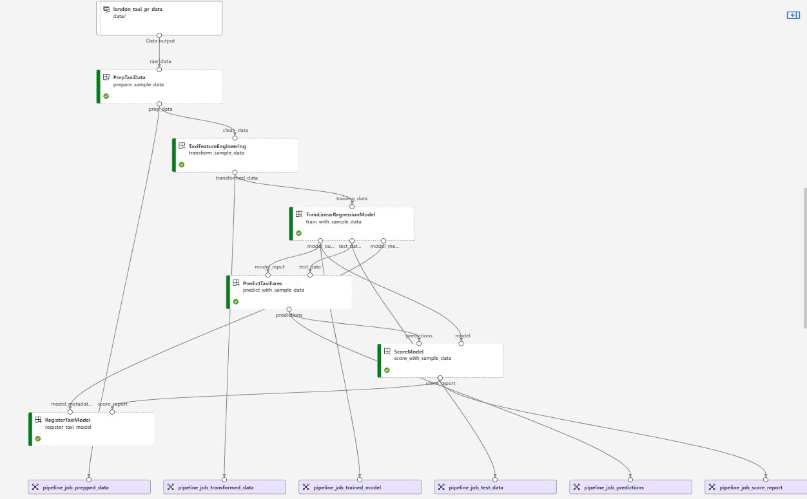

# Testing the initial setup

**Step 1.** In the main branch, supply explicit values or accept the defaults in the file config/config.yaml. The workflows use multiple variables and they should be set for both 'pr' and 'dev' plus any additional environments. Also, set the variables for all models (i.e. london_taxi, docker_taxi, sequence_model). The config.yaml file is split into the following sections; set the values in each section:

- aml_config: Stores the configuration of azure resources hosting the Azure Machine Learning workspace.
- environment_config: Stores the base image and dynamic properties set at runtime.
- pipeline_configs: Stores the configuration for pr and dev pipelines for each model supported by the solution.
- deploy_configs: Stores online and batch configuration for deployments for each model.

## Azure DevOps Steps (legacy/deprecated)

Azure Pipelines are deprecated and triggers are disabled; use the GitHub Workflows Steps below for active CI/CD. The steps in this section are retained for historical reference only.

**Step 1.** *Provision Infrastructure* - Execute the infrastructure provisioning pipeline (infra_provision_bicep_pipeline.yml OR infra_provision_terraform_pipeline.yml).

- .azure-pipelines/infra/bicep/infra_provision_bicep.yml
- .azure-pipelines/infra/bicep/infra_provision_terraform.yml

**Step 2.** *Register Data Assets* - Execute the register data asset pipeline (register_data_assets.yml).

- .azure-pipelines/register_data_assets.yml

**Step 3.** *Run CI workflow for a model of your choice* - Execute the GitHub Actions workflows listed below for build validation
Pipeline Parameters:

- exec_environment: The environment to run the workflow in. Set to "ci" by default
- model_type: The type of model for which to run the CI workflow. Set to {model name} by default

Pipelines:

- .azure-pipelines/london_taxi_ci_pipeline.yml
- .azure-pipelines/docker_taxi_ci_pipeline.yml

**Step 4.** *Run CD pipeline for a model of your choice* - Execute any of the Azure Pipelines created above for continuous integration.

Pipeline Parameters:

- exec_environment: The environment to run the workflow in. Set to "ci" by default
- model_type: The type of model for which to run the CI workflow. Set to {model name} by default

Pipelines:

- .azure-pipelines/london_taxi_cd_pipeline.yml
- .azure-pipelines/docker_taxi_cd_pipeline.yml

## GitHub Workflows Steps

**Step 1.** *Provision Infrastructure* - Execute the infrastructure provision workflow:

- .github/workflows/infra_provision_bicep.yml
- .github/workflows/infra_provision_terraform.yml

**Step 2.** *Register Data Assets* - Execute the register data asset workflow:

- .github/workflows/register_data_assets.yml

**Step 3.** *Run CI workflow for a model of your choice* - Execute the GitHub Actions workflows listed below for build validation.

Workflow Parameters:

- exec_environment: The environment to run the workflow in. Set to "pr" by default.
- model_type: The type of model for which to run the CI workflow. Set to {model name} by default.

Workflows:

- .github/workflows/london_taxi_ci_pipeline.yml
- .github/workflows/docker_taxi_ci_pipeline.yml
- .github/workflows/sequence_model_ci_pipeline.yml

**Step 4.** *Run CD workflow for a model of your choice* - Execute the GitHub Actions workflows listed below for deployment validation.

Workflow Parameters:

- exec_environment: The environment to run the workflow in. Set to "dev" by default.
- model_type: The type of model for which to run the CD workflow. Set to {model name} by default.

Workflows:

- .github/workflows/london_taxi_cd_pipeline.yml
- .github/workflows/docker_taxi_cd_pipeline.yml
- .github/workflows/sequence_model_cd_pipeline.yml

Below is a sample job run for the CI workflow.

## Preparing to Extend the Solution

**Step 1.** Clean up unneeded directories and files.

### If you used GitHub Actions and Bicep for infrastructure provisioning:

- Delete .azure-pipelines/ (if you don't need it for reference)
- Delete infra/terraform/

### If you used GitHub Actions and Terraform for infrastructure provisioning:

- Delete .azure-pipelines/ (if you don't need it for reference)
- Delete infra/bicep/

- ./azure-pipelines
- /infra/terraform
- .github/infra_provision_terraform.yml

### If you used Github Actions and Terraform for the infrastructure provisioning, delete the following directories/files

- ./azure-pipelines
- /infra/bicep
- .github/infra_provision_bicep.yml

### Your team already has a process for provisioning data needed by your models, therefore, delete the data configuration files included in the solution for testing purposes

- config/data_config.json

**Step 2.** Since you can confidently build the infrastructure, register data assets, and run a ci and cd build for a model, you are ready to add your own use cases to the Model Factory. See [Onboarding a New Model](./OnboardingNewModel.md)

## Known Issues

- Currently, there are two file formats in use for configuration files. We have logged a bug against this and will make the format consistent in an upcoming release. See [Different Config file formats](https://github.com/microsoft/dstoolkit-mlops-v2/issues/107)
- Use of a single configuration file could become a usability issue when there are many models supported by the solution, accordingly, we have raised an enhancement request to modularize the model configuration. See [Many Models Configuration Usability Issue](https://github.com/microsoft/dstoolkit-mlops-v2/issues/110).
